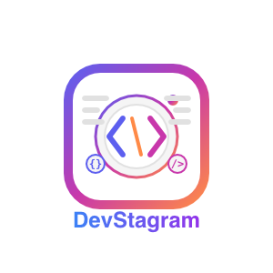

# DevStagram

<p align="center">
  
</p>

DevStagram es una red social diseñada específicamente para desarrolladores, donde pueden compartir sus proyectos, fragmentos de código y avances técnicos en un entorno visual inspirado en Instagram.

> Este proyecto fue desarrollado siguiendo el curso: [Laravel: Crea Aplicaciones y Sitios Web con PHP y MVC](https://www.udemy.com/course/curso-laravel-crea-aplicaciones-y-sitios-web-con-php-y-mvc/) de Udemy.

## 🚀 Demo

**¡Prueba la aplicación en vivo!**: [https://devstagram-davto-xyz.domcloud.dev/](https://devstagram-davto-xyz.domcloud.dev/)

Registra una cuenta o explora el feed público para ver la funcionalidad completa.

## ✨ Características

- **Sistema de Autenticación Completo**: Registro personalizado, login y gestión de sesiones
- **Perfiles de Usuario**: Usernames únicos y avatares personalizables
- **Publicaciones con Imágenes**: Carga de imágenes mediante drag & drop
- **Feed de Publicaciones**: Timeline personalizado con contenido de usuarios seguidos
- **Sistema Social**: Seguidores/seguidos, likes y comentarios en tiempo real
- **Dashboard Personalizado**: Vista principal adaptada a tus intereses
- **Diseño Responsive**: Optimizado para cualquier dispositivo

## 🛠️ Stack Tecnológico

### Backend
- **Laravel 10**: Framework PHP con arquitectura MVC
- **PHP 8.1+**: Aprovechando las características más modernas del lenguaje
- **MySQL**: Base de datos relacional
- **Laravel Sanctum**: Autenticación y protección de rutas
- **Intervention/Image**: Procesamiento y optimización de imágenes

### Frontend
- **Tailwind CSS**: Framework CSS utility-first
- **Vite**: Build tool para frontend
- **JavaScript**: Vanilla JS con funcionalidades específicas
- **Dropzone.js**: Subida de imágenes mediante drag & drop
- **Livewire**: Para interactividad en tiempo real (comentarios, likes)

## 🗂️ Estructura del Proyecto

```
devstagram/
├── app/                    # Lógica principal de la aplicación
│   ├── Http/Controllers/   # Controladores que manejan las peticiones
│   ├── Models/             # Modelos Eloquent para interactuar con la BD
│   └── ...
├── resources/              # Assets y vistas
│   ├── views/              # Plantillas Blade
│   ├── js/                 # JavaScript
│   └── css/                # Archivos CSS (Tailwind)
├── routes/                 # Definición de rutas
│   └── web.php             # Rutas web organizadas por secciones
├── public/                 # Archivos públicos accesibles
│   └── uploads/            # Imágenes subidas por los usuarios
└── database/               # Migraciones y seeds
    └── migrations/         # Esquema de la base de datos
```

## 🔄 Relaciones de Base de Datos

- **User**: Relaciones hasMany con Posts, Likes y belongsToMany para followers/following
- **Post**: belongsTo User, hasMany Comments y Likes
- **Like**: belongsTo User y Post
- **Comentario**: belongsTo User y Post
- **Follower**: Tabla pivote para relación many-to-many entre usuarios

## 📥 Instalación y Configuración

1. **Clonar el repositorio**:
   ```bash
   git clone https://github.com/davto-xyz/devstagram.git
   cd devstagram
   ```

2. **Instalar dependencias**:
   ```bash
   composer install
   npm install
   ```

3. **Configurar entorno**:
   ```bash
   cp .env.example .env
   php artisan key:generate
   ```

4. **Configurar base de datos** en el archivo `.env`

5. **Ejecutar migraciones**:
   ```bash
   php artisan migrate
   ```

6. **Compilar assets**:
   ```bash
   npm run dev
   ```

7. **Iniciar servidor de desarrollo**:
   ```bash
   php artisan serve
   ```

## 💻 Uso

1. Regístrate con email, nombre y username único
2. Personaliza tu perfil con una imagen y descripción
3. Explora el feed principal o perfiles de otros desarrolladores
4. Sigue a usuarios cuyos proyectos te interesen
5. Publica tus propios proyectos con imágenes y descripciones
6. Interactúa mediante likes y comentarios

## 📜 Licencia

Este proyecto está bajo la Licencia MIT. Ver el archivo `LICENSE` para más detalles.

## 👨‍💻 Autor

David Torres - [LinkedIn](https://www.linkedin.com/in/david-torres-l%C3%B3pez/) - [GitHub](https://github.com/davto-xyz)

---

<p align="center">
  Desarrollado con ❤️ usando Laravel y Tailwind CSS
</p>

<p align="center">
  <a href="https://devstagram-davto-xyz.domcloud.dev/" target="_blank">🔗 Visita DevStagram</a>
</p>
